# Hakunamakuba's Halo CE Custom Map Bundle

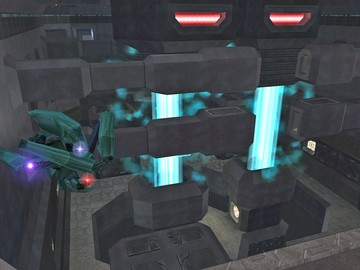  
Alerion  

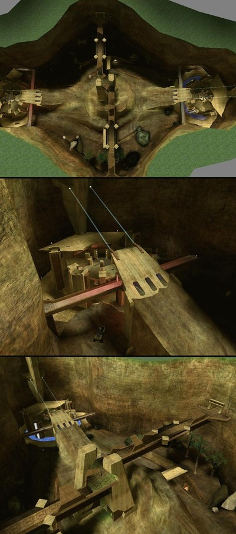  
anxiety  

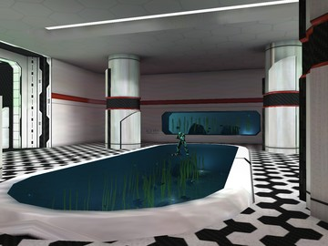  
aquarii_final  

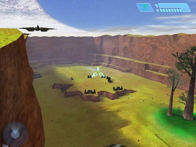  
Area52  

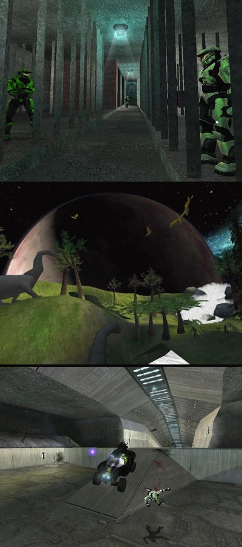  
Area53  

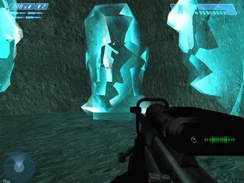  
Area54  

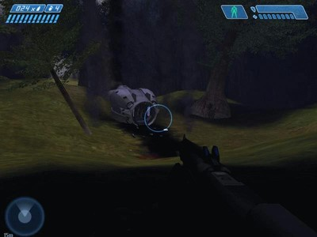  
Area55  

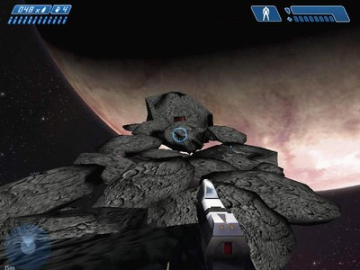  
asteroid  

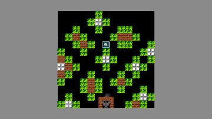  
battlecity_lvl1  

  
battlecity_lvl22  

  
battlecity_lvl9  

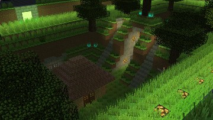  
battlecraft_hd  

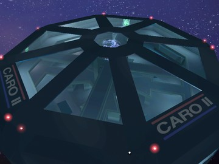  
bc_carousel_mp  

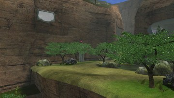  
bc_clearing_ground_mp  

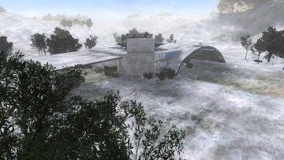  
Bigass  

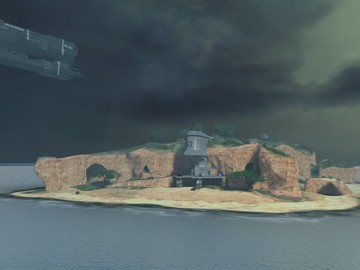  
Blackisland  

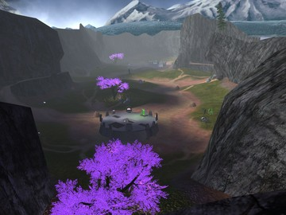  
Bloodrage  

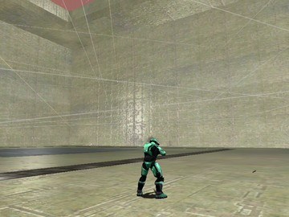  
bounce_arena  

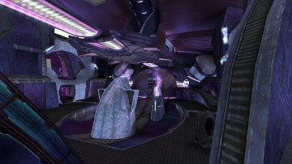  
bouncy  

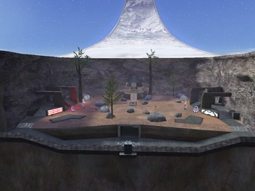  
bune  

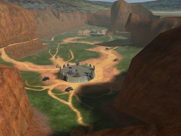  
Clantss  

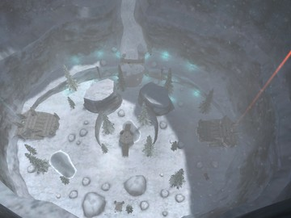  
cmt_g3_augur  

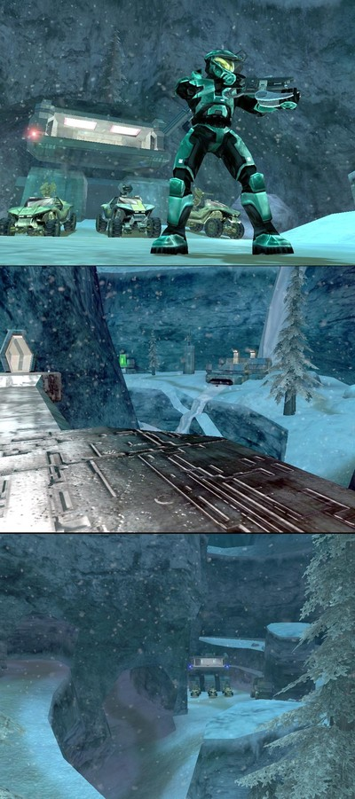  
cmt_Snow_Grove  

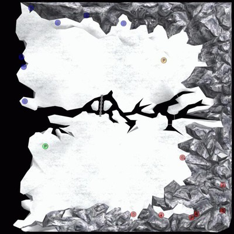  
Coldsnap  

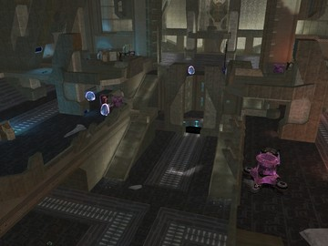  
colossus  

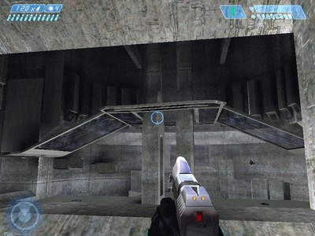  
corrupted  

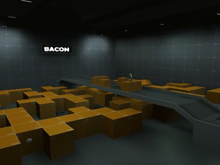  
deagle6_texture  

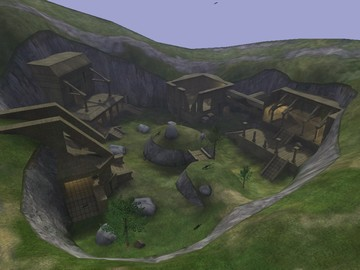  
deltaruined_intense  

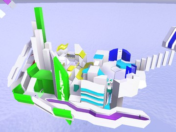  
Destiny  

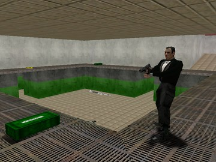  
dmt-goldeneye_stack-beta  

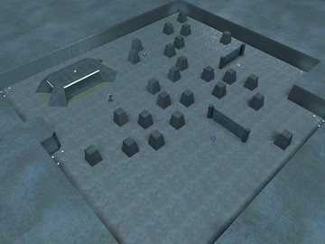  
dmt-ohh-low planes  

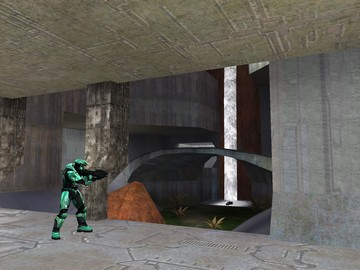  
downrush_h1.5  

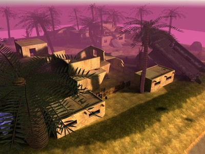  
Fogujah_1.2  

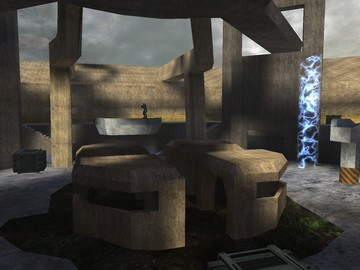  
foundation  

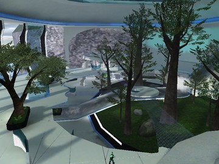  
Garden CE  

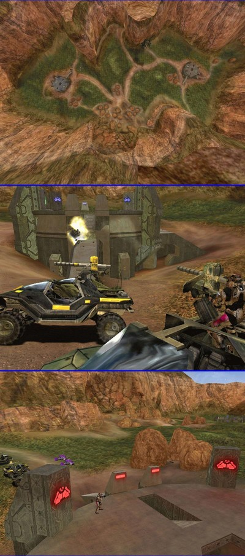  
H2 Coagulation  

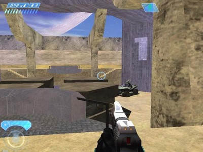  
h2-foundation  

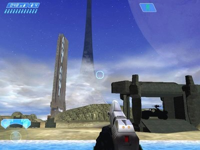  
h2-relic  

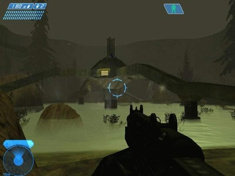  
H2_Backwoods  

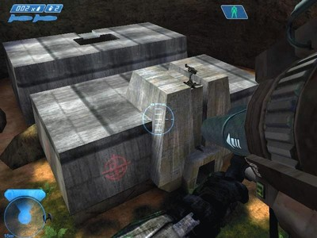  
h2_beaver_creek  

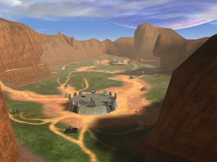  
H2_Blood_Gulch_CE_V2  

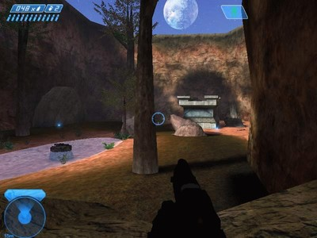  
H2_Momentum  

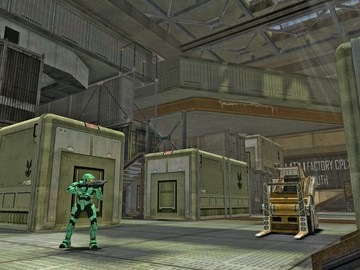  
h3 foundry  

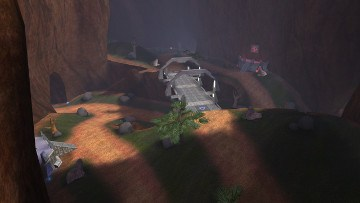  
hemoasis  

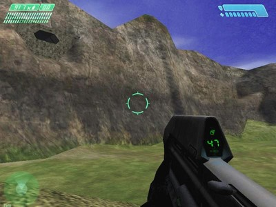  
Hugeass  

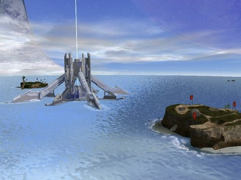  
Hydrolysis  

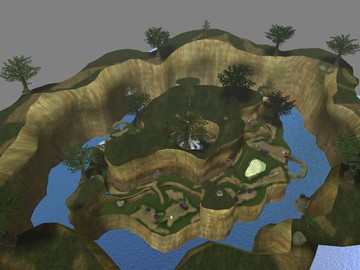  
hydro_generators  

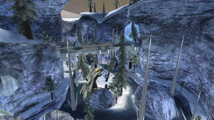  
icefloe  

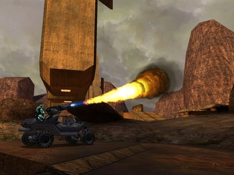  
Immure2  

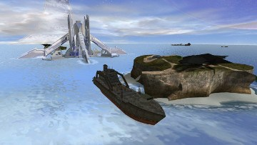  
Invasion_of_twins  

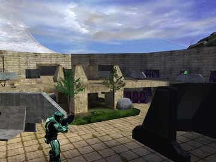  
isolation  

.jpg)  
kasheek_(starwars)  

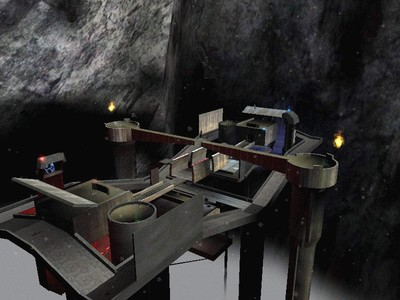  
lookout  

  
lookout_classic  

  
matrixcreek_reloaded  

  
MortalKombat  

  
Mystic  

  
nirvana_beta  

  
Off_Groundv1  

  
olympus_mons  

  
opavo  

  
overflow  

  
phoenix3  

  
pirate_ship  

  
prime_c3  

  
restless  

  
Runway  

  
Sciophobia v2  

  
seclusion  

  
Snowcast  

  
Snowdrop  

  
space  

  
space_dock  

  
starwars-beta_9732  

  
sympathy_mp  

  
testrun v0.5  

  
the_land_of_hyrule_v0.2.1  

  
thunderdometestmap_release  

  
Tlmp Lefty  

  
Train_Station  

  
Tusken Raid  

  
umt_archive  

  
windfall_island_v.2  

  
Yoyorast Island V2  

  
Yoyorast Island  

  
Zanzibar_H2_v2  

  
zerohour_h1.5  

  
ZO_Spirit_Temple  

  
z_coagulation_h2_pb2  

  
z_sanctuary_h2_pb2  

![[h2]desolation](assets/[h2]desolation.jpg)  
[h2]desolation  

![[H2]_ascension](assets/[H2]_ascension.jpg)  
[H2]_ascension  

![[H2]_beavercreek](assets/[H2]_beavercreek.jpg)  
[H2]_beavercreek  

![[H2]_Lockout](assets/[H2]_Lockout.jpg)  
[H2]_Lockout  

![[H2]_warlock](assets/[H2]_warlock.jpg)  
[H2]_warlock  

![[h3] Imposing V2](assets/[h3] Imposing V2.jpg)  
[h3] Imposing V2  

# Maintain file

Use the PowerShell script below to create the map list.

```powershell
Get-ChildItem | Where-Object { $_.Extension -ne ".map" } | ForEach-Object {
    Write-Host ")  "
    Write-Host "$($_.BaseName)  "
    Write-Host ""
}
```