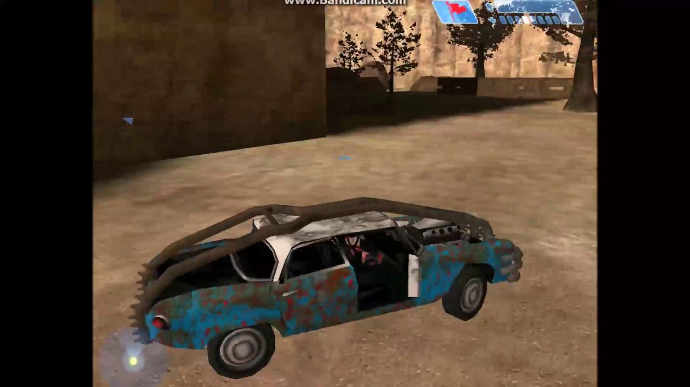
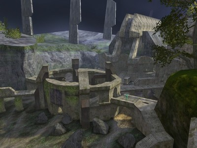

# Hakunamakuba's Halo CE Custom Map Bundle


Alerion


anxiety


aquarii_final


Area52


Area53


Area54


Area55


asteroid


battlecity_lvl1


battlecity_lvl22


battlecity_lvl9


battlecraft_hd


bc_carousel_mp


bc_clearing_ground_mp


Bigass


Blackisland


Bloodrage


bounce_arena


bouncy


bune


Clantss


cmt_g3_augur


CMT_G3_Ruins


cmt_g3_vestigial


cmt_Snow_Grove


Coldsnap


colossus


corrupted


deagle6_texture


deltaruined_intense


Destiny


dmt-goldeneye_stack-beta


dmt-ohh-low planes


downrush_h1.5


ewok


Fogujah_1.2


foundation


Garden CE


H2 Coagulation


h2-foundation


h2-relic


H2_Backwoods


h2_beaver_creek


H2_Blood_Gulch_CE_V2


H2_Momentum


h3 foundry


halo_banner


hemoasis


homestead


Hugeass


Hydrolysis


hydro_generators


icefloe


icelandic-tundra


Immure2


isolation

.jpg)
kasheek_(starwars)


little_bigass_v5


lookout


lookout_classic


matrixcreek_reloaded


MortalKombat


Mystic


nirvana_beta


Off_Groundv1


olympus_mons


opavo


overflow


phoenix3


pirate_ship


poq_ghost_town


prime_c3


rainbow-road


restless


Runway


Sciophobia v2


seclusion


siege


Snowcast


Snowdrop


space


space_dock


starwars-beta_9732


sympathy_mp


testrun v0.5


the_land_of_hyrule_v0.2.1


thunderdometestmap_release


Tusken Raid


umt_archive


viva_mexico


windfall_island_v.2


world_1-1


Yoyorast Island V2


Yoyorast Island


zerohour_h1.5


ZO_Spirit_Temple


z_coagulation_h2_pb2


z_sanctuary_h2_pb2

![[h2]desolation](assets/%5Bh2%5Ddesolation.jpg)
[h2]desolation

![[H2]_ascension](assets/%5BH2%5D_ascension.jpg)
[H2]_ascension

![[H2]_beavercreek](assets/%5BH2%5D_beavercreek.jpg)
[H2]_beavercreek

![[H2]_Lockout](assets/%5BH2%5D_Lockout.jpg)
[H2]_Lockout

![[H2]_warlock](assets/%5BH2%5D_warlock.jpg)
[H2]_warlock

![[h3] Imposing V2](assets/%5Bh3%5D%20Imposing%20V2.jpg)
[h3] Imposing V2

# Maintain file

Use the PowerShell script below to create the map list.

```powershell
Get-ChildItem | Where-Object { $_.Extension -ne ".map" } | ForEach-Object {
    Write-Host "))  "
    Write-Host "$($_.BaseName)  "
    Write-Host ""
}
```
